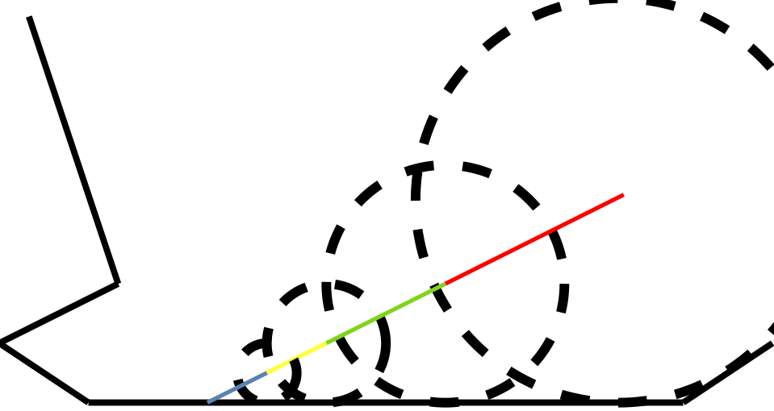
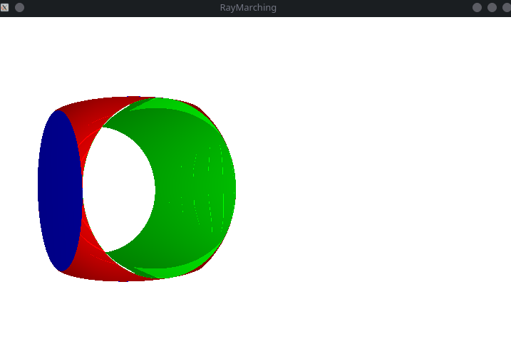

## Ray marching

Simple C++ library for 3D rendering based on a [RayMarching](https://www.youtube.com/watch?v=Cp5WWtMoeKg) concept. 

---

## Table of contents

[What is RayMarching?](#concept)

[Environment setup](#setup)

[Troubleshooting](#troubleshooting)

For information about the usage of the package please check out our [Doxygen site](https://thematiq.github.io/RayMarching/index.html) with the documentation. For more practical use as example code check [main.cpp](src/main/main.cpp) file.

---

## Concept

We can describe Ray Marching rendering using the algorithm below:

```python
for pixel in Screen:
  steps = 0
  current_point = pixel
  while steps < MAX_STEPS and distance > epsilon:
    distance = infinity
    for object in Scene:
      distance = min(distance, object.SDF(current_point))
    current_point.move(distance)
    steps += 1
  if steps < MAX_STEPS:
    pixel = closest object to the current_point
  else:
    pixel = background color
```

SDF means Signed Distance Function. It returns distance between given primitive object and point in space. Below is visualization of the process in the 2D space:



Here's example render created using this engine:



---

## Setup

### Installing dependencies

#### Linux

> sudo pacman -S glfw-x11 eigen

### CLion

- Go to File -> Settings -> Build, Execution, Deployment -> CMake
- Create new profile Debug
    - CMake options: -DCMAKE_BUILD_TYPE=Debug -DBUILD_UTEST=OFF
    - leave the rest of options as default

- Create new profile Test
    - CMake options: -DCMAKE_BUILD_TYPE=Debug -DBUILD_UTEST=ON
    - leave the rest of options as default

## Troubleshooting

### CMake cannot find GLFW3Config.cmake

This is caused by linux file system case sensitivity. You can simply solve that creating symlink:

> sudo ln -s <cmake-libs>/glfw3/glfw3Config.cmake <cmake-libs>/glfw3/GLFW3Config.cmake